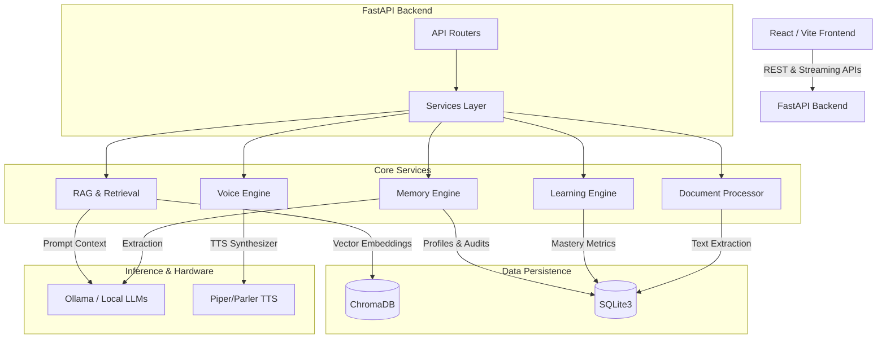

# SmilAI Platform Architecture (v1.3.5)

## Overview
SmilAI is an offline-first AI educational platform designed to run entirely locally without cloud dependencies. It leverages specialized subsystems for context retrieval (RAG), conversational memory, educational metrics (Learning Engine), and synthesized speech.

---

## 1. System Topology

---

## 2. Package Descriptions

### `frontend/`
- **Role:** Web-based user interface using React, Vite, and TailwindCSS.
- **Key Constraints:** Must run fluidly on low-end hardware. Offline-capable Browser STT is handled directly in the frontend, sending raw text to the backend.

### `backend/src/python/app/`

#### `api/` (API Layer)
- **Role:** FastAPI REST endpoints and WebSocket/Streaming routers.
- **Functionality:** Handles HTTP requests, streaming responses for chat (to hide latency), and file uploads. No deep business logic lives here.

#### `rag/` (Retrieval-Augmented Generation)
- **Role:** Document intelligence and context generation.
- **Functionality:**
  - `prompt_builder.py`: Dynamically constructs the LLM context window using the persona, retrieved syllabus chunks, and conversational history.
  - `inference.py`: Streams responses from the local Qwen/Llama model via Ollama.
  - `guardrails.py`: Offline heuristics to detect prompt injection or off-topic queries before they hit the LLM.

#### `memory/` (Student State & Memory Engine)
- **Role:** Long-term personalization.
- **Functionality:** Extracts facts, struggles, and preferences asynchronously from chats (e.g., "Student struggles with fractions"). It uses a strict confidence threshold (`>0.70`) to prevent polluting the student profile.

#### `learning_engine/` (Educational Metrics)
- **Role:** Deterministic academic tracking.
- **Functionality:** Replaces LLM-based hallucinated grades with strict Python math. Calculates Concept Mastery using a weighted formula (Assessments: 0.6, Practice: 0.2, Chat: 0.2, Teacher override: 1.0). Controls the automated Revision Scheduler.

#### `assessment/` & `assignment/` (Evaluation)
- **Role:** Curriculum testing.
- **Functionality:** Auto-generates quizzes grounded strictly in retrieved chunks. Grades student submissions and updates the Learning Engine.

#### `voice/` (Speech Synthesis)
- **Role:** Local Text-to-Speech (TTS).
- **Functionality:** Strips markdown and math syntax (`prepare_speech_text`), splits sentences, and caches audio files locally to ensure instant playback on repeated queries.

#### `documents/` (Data Ingestion)
- **Role:** Syllabus parsing.
- **Functionality:** Parses PDFs/DOCX files, chunks them deterministically, and saves them to ChromaDB.

#### `core/` (System Foundation)
- **Role:** Bootstrapping and configurations.
- **Functionality:** Manages the `DeploymentProfile` (Lite, Standard, Pro) ensuring the app degrades gracefully depending on the host machine's RAM/GPU. Houses telemetry logging for latency metrics.

#### `database/` (Persistence)
- **Role:** Local Storage.
- **Functionality:** Direct SQLite wrapper ensuring `PRAGMA foreign_keys = ON;` and Write-Ahead Logging for high concurrency.

---

## 3. Deployment Profiles
SmilAI configures itself automatically at startup to fit hardware limits:

- **Lite:** Whisper Tiny, Piper TTS, Qwen-2.5 1.5B (No GPU required)
- **Standard:** Whisper Base, Parler TTS, Qwen-2.5 3B (Entry-level GPU)
- **Pro:** Whisper Large, Parler TTS, Qwen-2.5 7B (Dedicated VRAM)

---

## 4. The Flow of a Chat Request
1. **Request:** Student sends a message.
2. **Guardrails:** `app.rag.guardrails` blocks injection attempts.
3. **Rewrite:** Query is optimized for vector search (if academic).
4. **Retrieve:** `app.rag.retrieve` fetches top-k chunks from ChromaDB.
5. **Prompt Build:** `app.rag.prompt_builder` assembles chunks, history, and student memory.
6. **Generate:** `Ollama` streams the response back to the UI.
7. **Background Tasks:** 
   - `app.memory` analyzes the turn for new profile traits.
   - `app.learning_engine` updates mastery metrics if relevant.
   - `app.api.voice` queues background TTS generation.
